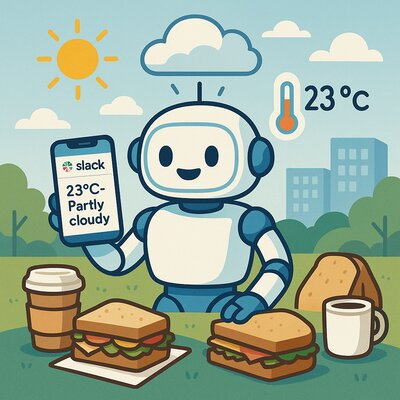

# 🌤️ Lunch Weather Bot

A smart serverless weather bot that automatically sends Slack messages when weather conditions are favorable for outdoor lunch meetups. Built with TypeScript, AWS Lambda, and deployed with OpenTofu.



## ✨ Features

- **Automatic Weather Monitoring**: Checks weather conditions every weekday at 10 AM CEST
- **Smart Weather Logic**: Only sends messages when weather is good (>12°C, sunny/cloudy)
- **Weather Warnings**: Optional notifications when weather is poor (opt-in feature)
- **Rate Limiting**: Maximum 2 messages per week per message type (tracked in DynamoDB)
- **Reply API Endpoint**: Team members can confirm lunch meetings and manage notification preferences
- **Manual Testing**: Trigger from AWS Console with customizable parameters
- **Secure Storage**: Webhook URL stored in AWS Secrets Manager for security
- **Multiple Teams**: Support for multiple deployments with different configurations

## 🏗️ Architecture

```
┌─────────────────┐    ┌─────────────────┐    ┌─────────────────┐
│   EventBridge   │───▶│  Weather Check  │───▶│ Slack Webhook   │
│  (Scheduler)    │    │    Lambda       │    │                 │
└─────────────────┘    └─────────────────┘    └─────────────────┘
                                │
                                ▼
                       ┌─────────────────┐
                       │    DynamoDB     │    ┌─────────────────┐
                       │ (Message Store) │◀───│ Team Members    │
                       │ + Preferences   │    │ (Reply API)     │
                       └─────────────────┘    └─────────────────┘
                                ▲                      │
                                │                      ▼
                       ┌─────────────────┐             │
                       │  Reply Lambda   │◀────────────┘
                       │  (Confirm +     │    ┌─────────────────┐
                       │   Preferences)  │◀───│  API Gateway    │
                       └─────────────────┘    │   (/reply)      │
                                              └─────────────────┘
                                                       │
                                              ┌─────────────────┐
                                              │ Secrets Manager │
                                              │ (Webhook URL)   │
                                              └─────────────────┘
```

## 🚀 Quick Start

### Prerequisites

- Node.js 22.x or higher
- AWS CLI configured with appropriate permissions
- OpenTofu >= 1.0
- A Slack workspace with webhook URL

### 1. Clone and Install

```bash
git clone <repository-url>
cd lunch-slack-bot
npm install
```

### 2. Quick Setup (Recommended)

Use the automated setup script:

```bash
cd terraform
chmod +x setup-bot.sh
./setup-bot.sh
```

The script will guide you through:

- ✅ Creating `terraform.tfvars` with your configuration
- ✅ Setting up remote state backend (S3 + DynamoDB)
- ✅ Building and deploying the application
- ✅ Creating AWS Secrets Manager secret for webhook URL
- ✅ Providing testing instructions

### 2b. Manual Configuration (Alternative)

If you prefer manual setup:

1. **Configure OpenTofu variables:**

    ```bash
    cd terraform
    cp terraform.tfvars.example terraform.tfvars
    # Edit terraform.tfvars with your configuration
    ```

2. **Set up terraform.tfvars:**

    ```hcl
    # Location settings
    location_name = "Munich"
    location_lat  = 48.1351
    location_lon  = 11.5820

    # AWS settings
    aws_region = "eu-central-1"

    # Optional: for multiple deployments
    deployment_suffix = "team-alpha"
    ```

3. **Deploy infrastructure:**

    ```bash
    # Build the application (from project root)
    npm run build

    # Deploy to AWS (from terraform directory)
    cd terraform
    tofu init
    tofu plan
    tofu apply
    ```

4. **Set up Slack webhook secret:**
    ```bash
    # After deployment, set the webhook URL in Secrets Manager
    aws secretsmanager put-secret-value \
      --secret-id "lunch-bot/slack-webhook" \
      --secret-string '{"webhook_url": "https://hooks.slack.com/services/YOUR/WEBHOOK/URL"}'
    ```

> ⚠️ **Security Note**: The Slack webhook URL is now stored in AWS Secrets Manager for enhanced security. Never commit webhook URLs to version control!

### 3. Multiple Teams/Deployments

To deploy multiple instances for different teams or channels:

**Using the setup script (recommended):**

```bash
# For each team, create a new workspace
tofu workspace new team-alpha
./setup-bot.sh  # Script will prompt for team-specific settings

tofu workspace new team-beta
./setup-bot.sh  # Configure for team beta
```

**Manual approach:**

```bash
# Team Alpha configuration
deployment_suffix = "team-alpha"
location_name     = "Munich"
location_lat      = 48.1351
location_lon      = 11.5820

# Team Beta configuration (different workspace)
tofu workspace new team-beta
deployment_suffix = "team-beta"
location_name     = "Berlin"
location_lat      = 52.5200
location_lon      = 13.4050
```

This creates separate resources for each team:

- Lambda functions: `lunch-weather-bot-team-alpha-weather-check`
- DynamoDB tables: `lunch-weather-bot-team-alpha-message-tracking`
- Secrets: `lunch-bot-team-alpha/slack-webhook`

## 🔄 Reply API - Team Interaction

The bot provides a comprehensive Reply API that allows team members to interact with the system and manage their notification preferences.

### API Endpoint

After deployment, OpenTofu outputs the API URL:

```
https://[api-id].execute-api.[region].amazonaws.com/prod/reply
```

### Available Actions

#### 1. Confirm Lunch Meeting

Confirm that your team is meeting for lunch, which stops further weather reminders for the current week:

```bash
# Basic lunch confirmation
curl -X POST https://[api-id].execute-api.eu-central-1.amazonaws.com/prod/reply \
  -H "Content-Type: application/json" \
  -d '{"action": "confirm-lunch"}'

# Confirm lunch for specific location
curl -X POST https://[api-id].execute-api.eu-central-1.amazonaws.com/prod/reply \
  -H "Content-Type: application/json" \
  -d '{"action": "confirm-lunch", "location": "Berlin"}'

# GET request alternative
curl "https://[api-id].execute-api.eu-central-1.amazonaws.com/prod/reply?action=confirm-lunch&location=Munich"
```

#### 2. Opt-in to Weather Warnings

Receive notifications when the weather is poor for outdoor lunch:

```bash
curl -X POST https://[api-id].execute-api.eu-central-1.amazonaws.com/prod/reply \
  -H "Content-Type: application/json" \
  -d '{"action": "opt-in-warnings", "location": "Munich"}'
```

#### 3. Opt-out of Weather Warnings

Stop receiving bad weather notifications:

```bash
curl -X POST https://[api-id].execute-api.eu-central-1.amazonaws.com/prod/reply \
  -H "Content-Type: application/json" \
  -d '{"action": "opt-out-warnings", "location": "Munich"}'
```

### API Response Examples

**Lunch Confirmation (New):**

```json
{
    "message": "Thanks for confirming! Lunch confirmed for this week. No more weather reminders will be sent.",
    "action": "confirm-lunch",
    "location": "Munich",
    "confirmed": true,
    "config": {
        "locationName": "Munich",
        "minTemperature": 12,
        "awsRegion": "eu-central-1",
        "slackWebhookUrl": "[REDACTED]"
    }
}
```

**Already Confirmed:**

```json
{
    "message": "Lunch already confirmed this week! No more weather reminders will be sent.",
    "location": "Munich",
    "alreadyConfirmed": true
}
```

**Weather Warnings Opt-in:**

```json
{
    "message": "Successfully opted in to weather warnings. You will now receive notifications when the weather is not suitable for outdoor lunch.",
    "action": "opt-in-warnings",
    "location": "Munich",
    "optedIn": true
}
```

**Weather Warnings Opt-out:**

```json
{
    "message": "Successfully opted out of weather warnings. You will no longer receive notifications about bad weather.",
    "action": "opt-out-warnings",
    "location": "Munich",
    "optedIn": false
}
```

### Integration Ideas

- **Slack Slash Command**: Create a Slack app that calls this endpoint
- **Simple Web Form**: Build a basic HTML form for team members
- **Mobile App**: Integrate into your team's mobile app
- **Scheduled Call**: Automatically confirm if calendar shows a lunch meeting

## 🔧 Configuration

### Weather Settings

The bot considers weather "good" when:

- Temperature > 12°C at specified hour (default: noon)
- Conditions are sunny or partly cloudy
- No rain, thunderstorms, or snow

**Weather warnings** are sent when:

- Temperature ≤ 12°C OR bad weather conditions
- Location has opted in to receive warnings
- Weekly message limits haven't been exceeded

Override settings at runtime through event parameters or modify defaults in `src/utils/env.ts`:

```typescript
// Default weather configuration
minTemperature: overrides?.minTemperature ?? 12,
goodWeatherConditions: overrides?.goodWeatherConditions ?? ['clear', 'clouds'],
badWeatherConditions: overrides?.badWeatherConditions ?? ['rain', 'drizzle', 'thunderstorm', 'snow'],
weatherCheckHour: overrides?.weatherCheckHour ?? 12, // Default to noon
```

### Rate Limiting

- **Weather Reminders**: Maximum 2 per week (when weather is good)
- **Weather Warnings**: Maximum 2 per week (when weather is poor, opt-in only)
- **Tracking**: DynamoDB table with automatic cleanup after 30 days
- **Logic**: Separate limits for each message type and location

### Scheduling

Default schedule: Weekdays at 10 AM CEST (8 AM UTC)

Modify in `terraform/main.tf`:

```hcl
resource "aws_cloudwatch_event_rule" "weather_check_schedule" {
  schedule_expression = "cron(0 8 ? * MON-FRI *)"
}
```

## 🧪 Manual Testing

You can manually trigger the lambda function from the AWS Console with customizable parameters:

1. Go to AWS Console → Lambda → `lunch-weather-bot-weather-check`
2. Click "Test" button
3. Create a test event with optional parameter overrides

### Available Override Parameters

All parameters are optional and fall back to defaults if not provided:

```json
{
    "overrides": {
        "locationName": "Berlin",
        "locationLat": 52.52,
        "locationLon": 13.405,
        "dynamodbTableName": "my-custom-table",
        "minTemperature": 15,
        "goodWeatherConditions": ["clear", "clouds"],
        "badWeatherConditions": ["rain", "drizzle", "snow"],
        "weatherCheckHour": 14
    }
}
```

### Testing Examples

**Test different location:**

```json
{
    "overrides": {
        "locationName": "Paris",
        "locationLat": 48.8566,
        "locationLon": 2.3522
    }
}
```

**Test with relaxed weather criteria:**

```json
{
    "overrides": {
        "minTemperature": 8,
        "goodWeatherConditions": ["clear", "clouds", "rain"],
        "badWeatherConditions": ["thunderstorm", "snow"]
    }
}
```

**Test for evening weather (6 PM):**

```json
{
    "overrides": {
        "weatherCheckHour": 18
    }
}
```

**Use all defaults:**

```json
{}
```

## 🔑 Slack Webhook Setup

1. Go to [Slack API](https://api.slack.com/apps)
2. Create a new app or use existing one
3. Go to "Incoming Webhooks" and activate it
4. Click "Add New Webhook to Workspace"
5. Choose your channel and copy the webhook URL
6. Store the webhook URL in AWS Secrets Manager (see deployment instructions)

## 🔒 Security & Secrets Management

### Enhanced Security Features

- **AWS Secrets Manager**: Webhook URL stored securely, not in configuration files
- **IAM Policies**: Least-privilege access for Lambda functions
- **Encrypted Storage**: DynamoDB encryption at rest
- **VPC Support**: Optional VPC deployment for enhanced network security

### Secrets Management

The webhook URL is stored in AWS Secrets Manager with the following structure:

```json
{
    "webhook_url": "https://hooks.slack.com/services/YOUR/WEBHOOK/URL"
}
```

**Setting the secret:**

```bash
aws secretsmanager put-secret-value \
  --secret-id "lunch-bot/slack-webhook" \
  --secret-string '{"webhook_url": "https://hooks.slack.com/services/T123/B456/xyz"}'
```

**For multiple teams:**

```bash
# Team Alpha
aws secretsmanager put-secret-value \
  --secret-id "lunch-bot-team-alpha/slack-webhook" \
  --secret-string '{"webhook_url": "https://hooks.slack.com/services/T123/B456/alpha"}'

# Team Beta
aws secretsmanager put-secret-value \
  --secret-id "lunch-bot-team-beta/slack-webhook" \
  --secret-string '{"webhook_url": "https://hooks.slack.com/services/T123/B789/beta"}'
```

## 📊 Monitoring & Observability

### CloudWatch Logs

- **Weather Check**: `/aws/lambda/lunch-weather-bot-weather-check`
- **Reply API**: `/aws/lambda/lunch-weather-bot-reply`

### DynamoDB Tables

- **Message Tracking**: `lunch-weather-bot-message-tracking`
- **Stores**: Message history, lunch confirmations, weather warning preferences

### EventBridge

- **Rule**: `lunch-weather-bot-schedule`
- **Target**: Weather check Lambda function

### API Gateway

- **Name**: `lunch-weather-bot-api`
- **Endpoint**: `/reply` (POST, GET, OPTIONS)

### Key Metrics to Monitor

- Lambda execution duration and errors
- DynamoDB read/write capacity utilization
- API Gateway request count and latency
- Weather API call success rate

## 🛠️ Development

### Local Development

```bash
# Install dependencies
npm install

# Run tests with watch mode
npm run test:watch

# Run tests with coverage
npm run test:coverage

# Build for deployment
npm run build

# Development build with watch mode
npm run build:dev

# Code quality checks
npm run cq              # Run all quality checks
npm run cq:lint         # ESLint
npm run cq:format       # Prettier
npm run cq:type-check   # TypeScript
```

### Project Structure

```
src/
├── handlers/                    # Lambda function handlers
│   ├── weather-check.ts        # Main weather checking logic
│   ├── reply.ts                # Reply API handler (lunch + preferences)
│   └── *.spec.ts               # Test files
├── implementations/             # Concrete implementations
│   ├── dynamodb-storage.ts     # DynamoDB operations
│   ├── webhook-slack.ts        # Slack webhook integration
│   ├── openmeteo-api.ts        # Weather API client
│   ├── secrets-manager-client.ts # AWS Secrets Manager client
│   └── fetch-http-client.ts    # HTTP client implementation
├── interfaces/                  # TypeScript interfaces
│   ├── storage.interface.ts    # Storage operations
│   ├── weather-api.interface.ts # Weather API contract
│   ├── webhook-slack.interface.ts # Slack webhook contract
│   └── http-client.interface.ts # HTTP client contract
├── schemas/                     # Zod validation schemas
│   ├── weather.schema.ts       # Weather data validation
│   └── openmeteo.schema.ts     # OpenMeteo API response validation
├── services/                    # Business logic
│   └── weather.service.ts      # Weather processing logic
├── types/                       # TypeScript type definitions
│   └── index.ts                # Common types
└── utils/                       # Utility functions
    ├── env.ts                  # Environment configuration
    ├── constants.ts            # Application constants
    └── coordinates.ts          # Location utilities

terraform/                       # Infrastructure as Code
├── main.tf                     # Main resources
├── lambda.tf                   # Lambda functions
├── api-gateway.tf              # API Gateway configuration
├── dynamodb.tf                 # DynamoDB table
├── secrets.tf                  # AWS Secrets Manager
├── variables.tf                # Input variables
├── outputs.tf                  # Output values
├── setup-bot.sh                # Complete setup script
└── setup-state-backend.md      # Manual backend setup docs
```

## 🌍 Environment Variables

| Variable                   | Description            | Default      |
| -------------------------- | ---------------------- | ------------ |
| `SLACK_WEBHOOK_SECRET_ARN` | Secrets Manager ARN    | Auto-set     |
| `LOCATION_NAME`            | Location name          | Munich       |
| `LOCATION_LAT`             | Latitude               | 48.1351      |
| `LOCATION_LON`             | Longitude              | 11.5820      |
| `AWS_REGION`               | AWS region             | eu-central-1 |
| `DYNAMODB_TABLE_NAME`      | DynamoDB table name    | Auto-set     |
| `REPLY_API_URL`            | Reply API endpoint URL | Auto-set     |

## 🔧 OpenTofu Variables

| Variable             | Description                      | Default      |
| -------------------- | -------------------------------- | ------------ |
| `location_name`      | Location name for weather checks | Munich       |
| `location_lat`       | Latitude coordinate              | 48.1351      |
| `location_lon`       | Longitude coordinate             | 11.5820      |
| `aws_region`         | AWS region for deployment        | eu-central-1 |
| `deployment_suffix`  | Suffix for resource names        | "" (empty)   |
| `environment`        | Environment name                 | prod         |
| `lambda_timeout`     | Lambda timeout in seconds        | 60           |
| `lambda_memory`      | Lambda memory in MB              | 256          |
| `log_retention_days` | CloudWatch log retention         | 14           |

## 📝 License

GPL-3.0 License - see LICENSE file for details.
